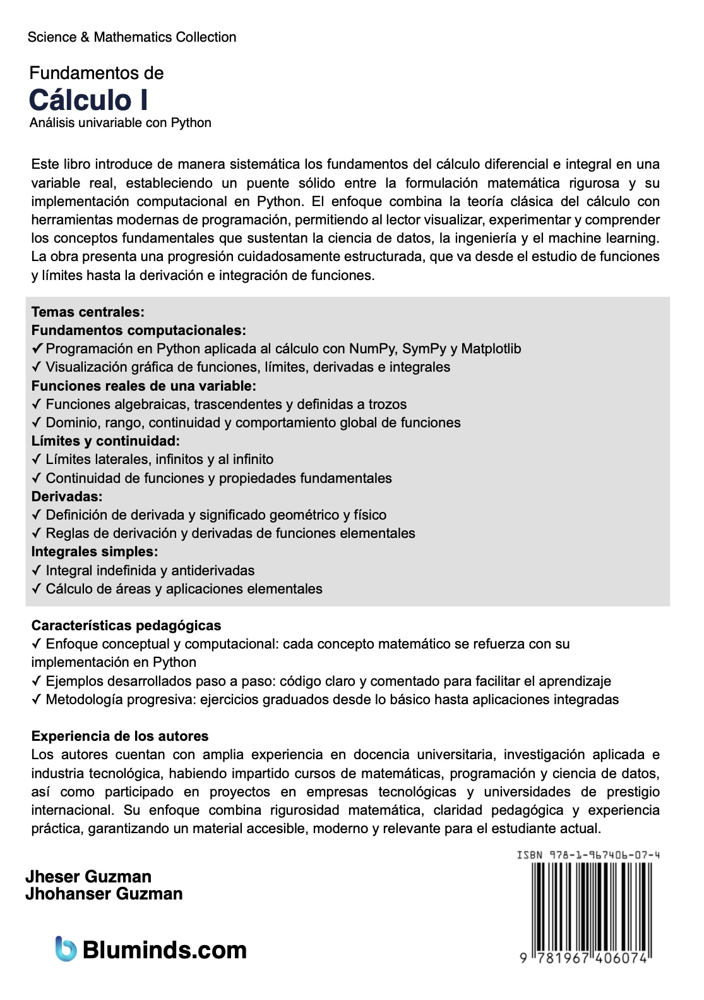
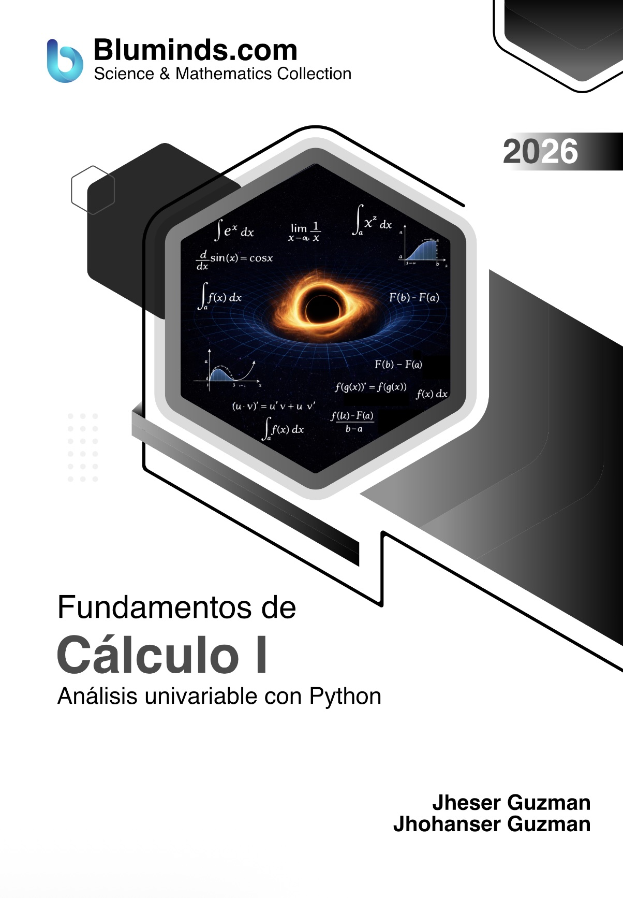

# Fundamentos de Cálculo I — 1ra Edición

**Autores:** Jheser Guzman, Jhohan Guzman

---

| FRONT COVER | REAR COVER |
|:---:|:---:|
|  |  |

---

## Descripción

Este libro introduce de manera sistemática los fundamentos del cálculo diferencial e integral en una variable real, estableciendo un puente sólido entre la formulación matemática rigurosa у su implementación computacional en Python. El enfoque combina la teoría clásica del cálculo con herramientas modernas de programación, permitiendo al lector visualizar, experimentar y comprender los conceptos fundamentales que sustentan la ciencia de datos, la ingeniería y el machine learning. La obra presenta una progresión cuidadosamente estructurada, que va desde el estudio de funciones y límites hasta la derivación e integración de funciones.

---

### Temas centrales

**Fundamentos computacionales:
- **✓ Programación en Python aplicada al cálculo con NumPy, SymPy y Matplotlib
- **✓ Visualización gráfica de funciones, límites, derivadas e integrales

**Funciones reales de una variable:
- **✓ Funciones algebraicas, trascendentes y definidas a trozos
- **✓ Dominio, rango, continuidad y comportamiento global de funciones

**Límites y continuidad:
- **✓ Límites laterales, infinitos y al infinito
- **✓ Continuidad de funciones y propiedades fundamentales

**Derivadas:
- **✓ Definición de derivada y significado geométrico y físico
- **✓ Reglas de derivación y derivadas de funciones elementales

**Integrales simples:
- **✓ Integral indefinida y antiderivadas
- **✓ Cálculo de áreas y aplicaciones elementales

---

### Características pedagógicas

- **✓ Enfoque conceptual y computacional: cada concepto matemático se refuerza con su implementación en Python
- **✓ Ejemplos desarrollados paso a paso: código claro y comentado para facilitar el aprendizaje
- **✓ Metodología progresiva: ejercicios graduados desde lo básico hasta aplicaciones integradas

---

### Experiencia de los autores

Los autores cuentan con amplia experiencia en docencia universitaria, investigación aplicada e industria tecnológica, habiendo impartido cursos de matemáticas, programación y ciencia de datos, así como participado en proyectos en empresas tecnológicas y universidades de prestigio internacional. Su enfoque combina rigurosidad matemática, claridad pedagógica y experiencia práctica, garantizando un material accesible, moderno y relevante para el estudiante actual.

---

## Presentaciones del libro

| Formato | Libro |
|---------|:---------:|
| 📗 **Paperback + Color** |  [🛒 Comprar en Amazon](https://www.amazon.com/dp/1234567890)|
| 📘 **Paperback + Escala de Grises** |  [🛒 Comprar en Amazon](https://www.amazon.com/dp/1234567890) |
| 📙 **Hardcover + Color Premium** | [🛒 Comprar en Amazon](https://www.amazon.com/dp/1234567890) |

---

## Tabla de Contenido

| # | Capítulo | Notebook |
|:-:|----------|:--------:|
| — | Antes de Comenzar | [▶](source_code/before_to_begin.ipynb) |
| 1 | Introducción al Cálculo | [▶](source_code/chapter_01.ipynb) |
| 2 | Geometría Analítica | [▶](source_code/chapter_02.ipynb) |
| 3 | Funciones de una variable  | [▶](source_code/chapter_03.ipynb) |
| 4 | Límites para funciones de una variable | [▶](source_code/chapter_04.ipynb) |
| 5 | Derivadas sobre funciones de una variable | [▶](source_code/chapter_05.ipynb) |
| 6 | Integrales sobre funciones de una variable | [▶](source_code/chapter_06.ipynb) |
| B | Apéndice B | [▶](source_code/ZZ_appendix_a.ipynb) |

> Cada capítulo incluye también un notebook de **problemas resueltos** (`chapter_XX_solved_problems.ipynb`).

📄 **Muestra gratuita:** [Descargar Capítulo 1 (PDF)](ebook_sample/Fundamentos%20de%20Cálculo%20I%2C%20Jheser%20Guzman%20y%20Jhohan%20Guzman%2C%202025%2C%20Ebook%20Sample%20%28Chapter%201%29.pdf)

---

## Contacto e Información

- 🌐 **Sitio web:** [www.bluminds.com](https://www.bluminds.com)
- 🐦 **Twitter / X:** [@blumindsllc](https://x.com/blumindsllc)
- 🎬 **YouTube:** [youtube.com/@bluminds](https://www.youtube.com/@bluminds)
- 💻 **Código Fuente:** [github.com/Bluminds/Book-Calc1-v1-CodeExamples](https://github.com/Bluminds/Book-Calc1-v1-CodeExamples)
- 💻 **Slides:** Contactar a [info@bluminds.com](mailto:info@bluminds.com) (incluye el recibo de compra del libro).
- 📧 **Contacto:** [info@bluminds.com](mailto:info@bluminds.com)

---

## Fe de Erratas

Si encuentras un error en el libro (tipográfico, matemático o de código), puedes reportarlo abriendo un [Issue en GitHub](https://github.com/Bluminds/Book-Calc1-v1-CodeExamples/issues) o enviando un correo a [info@bluminds.com](mailto:info@bluminds.com) con el asunto **"Fe de Erratas"**, indicando:
- Número de página
- Párrafo o sección donde se encuentra el error
- Descripción de la corrección propuesta

Las correcciones verificadas se registran en la siguiente tabla:

| Página | Párrafo | Corrección |
|--------|---------|------------|
| | | |
